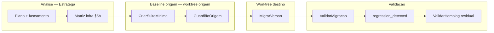
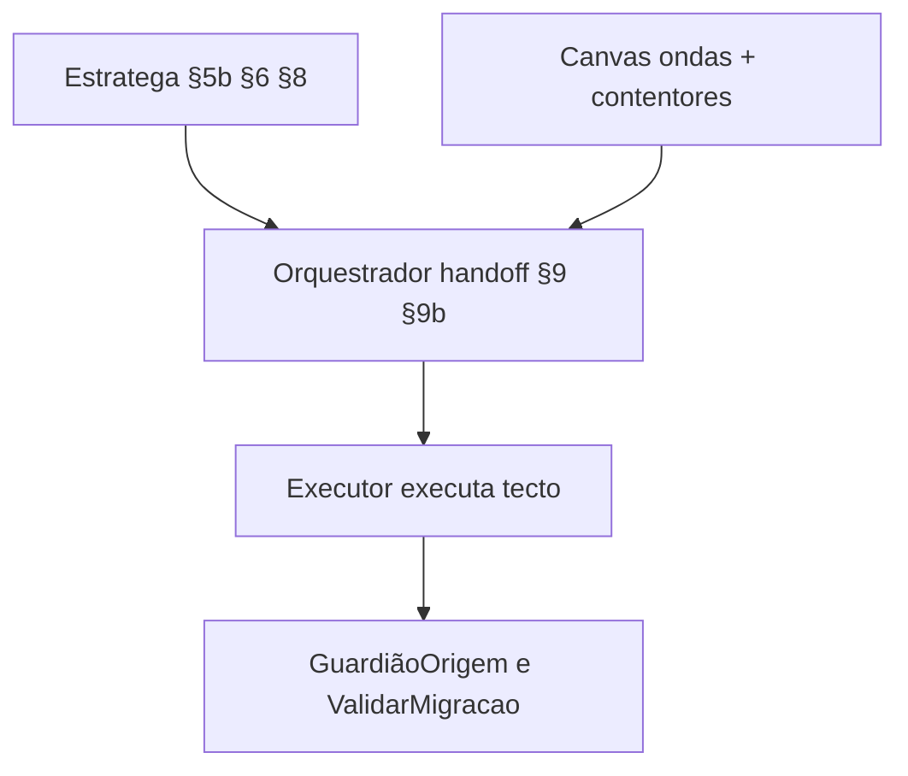

# Estratégia de testes faseada — migração .NET

> Referência operacional Estratega / Orquestrador / Executor / Guardião · **não** é especialização de pacote (`specializations/`).  
> Par com [padroes-candidatos-suite-minima.md](padroes-candidatos-suite-minima.md) e [test-contract-baseline-reuse.md](../../migracao-orquestrador/references/specializations/test-contract-baseline-reuse.md).

Modelo acordado: **priorizar automação**, **questionar infra (contentores)**, **origem → migrado** com **mesmos testes** sempre que possível; **duas worktrees** quando há salto de TFM; contentores opt-in.

## Princípio central

> Construir a **suite mínima** no **TFM origem** (worktree origem): piso (contrato HTTP + persistência se houver) **+** integrações com decisão `container_auto` / `alt_auto`. Validar com **GuardiãoOrigem** (suite default). Reutilizar o **mesmo teste** no **TFM destino**. Homolog = **residual** (credenciais reais / side-effects).

Isto separa:

- **Regressão da migração** — “passava no origem, falha no migrado” → culpa do upgrade.
- **Gap pré-existente** — “já não passava no origem” → não misturar com TFM.

## Fases (vocabulário canónico)

| Id | Grupo | Quem | O quê |
|----|-------|------|--------|
| **PrepararAmbiente** | — | Executor | Duas worktrees (origem + destino) + build no TFM origem |
| **CriarSuiteMinima** | Baseline origem | Executor | Piso + integrações auto aprovadas no Canvas — **no TFM origem** |
| **GuardiãoOrigem** | Baseline origem | Guardião | `dotnet test` default (sem flag de contentor) + suite mínima; gravar `guardiao-baseline` |
| **MigrarVersao** | — | Executor | TFM destino, pacotes, hosting (só worktree destino) |
| **ValidarMigracao** | — | Guardião | **Mesmos** testes; comparar com GuardiãoOrigem |
| **ValidarHomolog** | — | Humano | Residual: IdP/Vault reais, SASL/credenciais, side-effects de negócio |

Prioridades de cenário: **suite_minima** (piso + auto) · **manual** / residual · **opcional** (opt-in fora do gate).

## Perguntas obrigatórias (viabilidade infra)

Responder no report Estratega **§5b** com evidência (Diplomata, `docker-compose`, README, CI) — **uma linha por componente**, genérico:

| Pergunta | Se sim | Se não |
|----------|--------|--------|
| Contentores efêmeros são estratégia aceita (Canvas)? | Preferir `container_auto` para serviços de infra | Só `alt_auto` / `manual_homolog` |
| Existe **BD de teste** partilhada (CS hml/dev)? | Usar com cuidado (dados, isolamento) → pode ser `alt_auto` | Contentor efémero ou BD local |
| A **API sobe em contentor** hoje (`Dockerfile`)? | Avaliar smoke contentor **opt-in**; WAF primeiro | `WebApplicationFactory` in-process |
| Há **componente de integração** no caminho feliz (fila, broker, cache, storage de jobs, …)? | Automatizar com contentor do mesmo tipo **ou** alternativa auto; senão questionar e marcar `manual_homolog` | Fora de escopo |
| O residual exige **credencial real / side-effect**? | ValidarHomolog | Não fingir cobertura com mock |

**Regra prática:** tudo que for passível de automatizar deve ser **feito ou questionado**. Contentor = caminho preferido para serviços de infra quando aceito; pipe **sempre** parametrizada (opt-in/Skippable). Padrões: [padroes-candidatos-suite-minima.md](padroes-candidatos-suite-minima.md).

## Dosagem de custo (criar vs só rodar)

| Tipo | Criar antes? | GuardiãoOrigem | Pós migrado | Custo típico | Notas |
|------|--------------|----------------|-------------|--------------|-------|
| **Contrato HTTP** (mock / WAF) | **Sim** | Sim | **Mesmo teste** | M | Breaking de cliente sem parceiro real |
| **Persistência / BD** | **Sim** se no escopo | Sim (default; contentor skip ok) | **Mesmo teste** | M–H | Contentor opt-in ou `alt_auto` |
| **Integração (componente)** | **Sim** se `container_auto`/`alt_auto` | Sim se na suite default | Mesmo teste | M–H | Não adiar sem questionar |
| **Smoke WebApplicationFactory** | Avaliar | Sim | Mesmo teste | M | DI, Startup, JSON pipeline |
| **Unitários existentes** | Não (já existem) | Sim | Sim | L | Guardião compara contagem/outcome |
| **Residual real** | Não auto | Não | Homolog | H | IdP/Vault/SASL/side-effect |

**Custo** = esforço para **criar** a automação (L/M/H), não só tempo de CI.

## Matriz de faseamento (template report §6)

| Coluna | Significado |
|--------|-------------|
| `criar_antes` | Teste novo precisa existir antes do upgrade TFM? |
| `baseline` | Rodar no TFM origem (GuardiãoOrigem) |
| `pos_migrado` | Rodar no TFM destino com **mesma asserção** |
| `reutilizar_mesmo_teste` | Sim — só ajuste de pacote/config/host |
| `infra` | none / mock / container (opt-in) / alt_auto / manual |
| `custo_criar` | L / M / H |
| `decisão` | `container_auto` / `alt_auto` / `manual_homolog` |

## DoD mínimo sugerido (handoff)

1. Matriz infra (§5b) com decisões por componente; contentores aprovados ou rejeitados no Canvas.
2. GuardiãoOrigem gravado (TFM origem, suite default) na **worktree origem**.
3. Suite mínima **criada** e verde no origem (piso + integrações auto) **antes** do GuardiãoOrigem.
4. Após migração: **mesmos** testes da suite mínima verdes no destino (ValidarMigracao).
5. Residual homolog documentado (não inventário de produtos).

## Playbook

- Contratos reutilizáveis: [test-contract-baseline-reuse.md](../../migracao-orquestrador/references/specializations/test-contract-baseline-reuse.md)
- Integrações (Diplomata): fila de homologação §8b
- Roadmap: espelhar faseamento PrepararAmbiente→ValidarHomolog e DoD no report
- Guardião: `migracao:guardian-baseline` / `migracao:guardian-post` (valida `guardian_dod`)
- Worktrees: [worktree.md](../../migracao-executor/references/worktree.md)
- Checklist CriarSuiteMinima: [suite-minima.md](../../migracao-executor/references/suite-minima.md)

## Anti-padrões

- Só `dotnet test` **depois** sem GuardiãoOrigem → não atribui regressão.
- Uma única worktree com TFM já migrado → perde checkout origem comparável.
- Contentor **obrigatório** na pipe GitLab sem Docker / sem opt-in.
- Adiar integração para homolog **sem** questionar automação.
- Expandir suite do gate Guardião **depois** do GuardiãoOrigem.
- Promover `manual_homolog` → auto na execução sem emendao ao Canvas.
- Reescrever testes no migrado em vez de reutilizar → perde comparabilidade.
- **Executor inventar ordem de fases** ou inventário de testes além do §9b.

## Quem monta o plano executável?

| Papel | Entrega | Não entrega |
|-------|---------|-------------|
| **Estratega** (análise) | **Insumos:** §5b matriz, §6 faseamento, §8 DoD, custo L/M/H | Passos numerados do Executor |
| **Orquestrador** (handoff) | **Plano consolidado:** `handoff-execucao.md` **§9** + **§9b** (inventário fechado) | Código de teste |
| **Executor** (execução) | Segue §9/§9b; detalhe (paths, libs Testcontainers) dentro do tecto | Reordenar fases, pular GuardiãoOrigem, promover manual→auto |

### Regra

1. **Caminho normal:** Orquestrador **copia/adapta** `estratega-testes.md` §5b/§6/§8 para `handoff` §9b e alinha §9 com ondas do Canvas.
2. **Handoff incompleto:** plano ausente ou decisão material pendente retorna ao Orquestrador para completar e repetir gate. Executor resolve apenas detalhes locais dentro do plano aprovado, registrando em `execucao.md`. Mudança de decisão exige aprovação humana conforme [contrato de qualidade](../../migracao-orquestrador/references/qualidade-decisoes-evidencias.md#handoff-e-autorização).
3. **Desvio de ordem** (ex.: MigrarVersao antes de GuardiãoOrigem): exige aprovação humana + nota no handoff/lacunas.
4. **Desvio de tecto** (automatizar o que o Canvas marcou `manual_homolog`): exige emendao ao Canvas/§9b **antes** de codar.

### Ordem canónica (§9b)

| Fase | Gate | Responsável |
|------|------|-------------|
| PrepararAmbiente | Duas worktrees + build TFM origem | Executor |
| CriarSuiteMinima | Piso + integrações auto no TFM origem | Executor |
| GuardiãoOrigem | Baseline formal verde (suite default) | Guardião |
| MigrarVersao | Onda migração TFM/pacotes (Canvas §6 — Ondas de execução) na destino | Executor |
| ValidarMigracao | Mesma suite mínima + Guardião post | Guardião |
| ValidarHomolog | Residual real — se aceito | Humano/QA |

